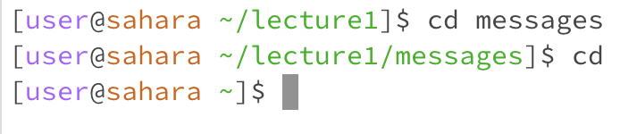

# Evan Wu - Lab 1 Report
---

## `cd` command
---

1. `cd` with no argument - run in `/home` - no error
   AND `cd` with no argument - run in `/home/lecture1/messages` - no error
---
   When the `cd` command is run in the root directory, nothing seems to happen. BUT, when the command is run in a directory that is not the root directory, it automatically brings us back to the root directory. This can be useful if you're working in a specific directory and need a simple way to get back to root directory where you can access everything else.

2. `cd` with path to directory as argument - run in `/home` - no error
---
   Our working directory is changed to our specified directory. Our new working directory is shown on the left terminal prompt in green.

3. `cd` with path to file as argument - run in `/home/lecture1` - error
---
   An error message pops up saying that our passed in argument is not a directory. Apparently, only directory paths can be passed as arguments
to the `cd` command.

## `ls` command
---

1. `ls` with no argument - run in `/home` - no error
---
   The `ls` command without any arguments lists out all directory and file names in our working directory.

2. `ls` with path to directory as argument - run in `/home` - no error
---
   The `ls` command with a directory as argument lists out all directory and file names in the directory passed as an argument.

3. `ls` with path to file as argument - run in `/home/lecture1` - no error
---
   The `ls` command with a file as argument seems to just print out the file name that was passed in.

## `cat` command
---

1. `cat` with no argument - run in `/home` - no error
---
   Running `cat` with no argument gives us a continuing empty prompt that allows us to type text into the terminal. Whatever we type is repeated. In my screenshot, I typed in hello, which was printed again once I pressed the Enter button.

2. `cat` with path to directory as argument - run in `/home` - error
---
   Running `cat` with a directory as argument gives us an error message. It seems like the `cat` command cannot take directory paths as arguments.

3. `cat` with path to file as argument - run in `/home/lecture1` - no error
---
   Running `cat` with a file as argument prints out whatever text was in the argument file to the terminal. In the screenshot, every line of code from Hello.java was printed onto the terminal.

