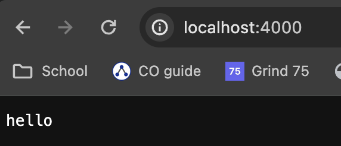
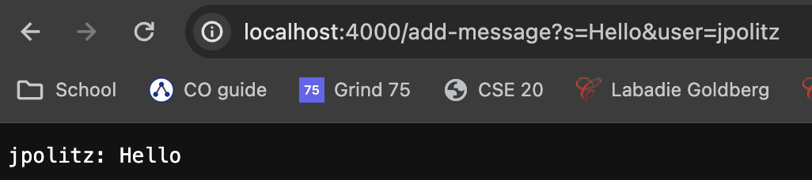
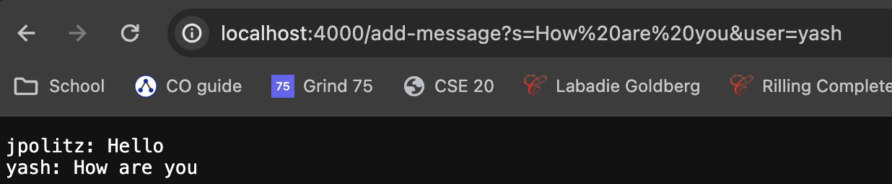
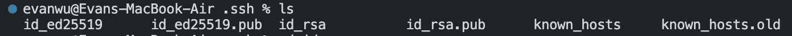
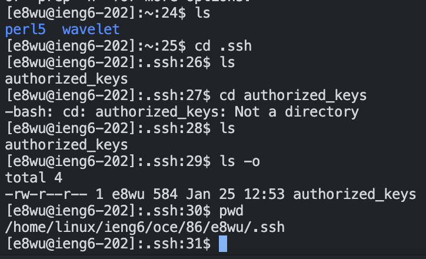
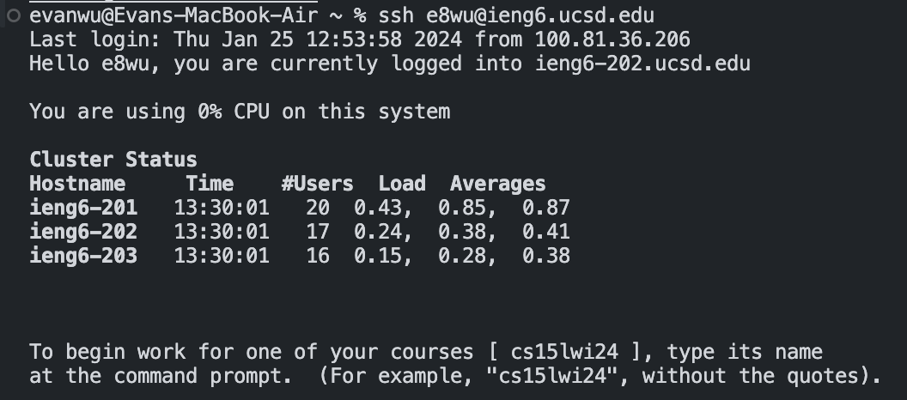

# Evan Wu - Lab 2 Report
---
## Part 1
---
ChatServer.java:
```java
import java.io.IOException;
import java.net.URI;
import java.util.*;

class Handler implements URLHandler {
    // The one bit of state on the server: a number that will be manipulated by
    // various requests.

    ArrayList<String> userA = new ArrayList<>();
    ArrayList<String> stringA = new ArrayList<>();

    public String handleRequest(URI url) {
        if (url.getPath().equals("/")) {
            return "hello";
        } 
        else if (url.getPath().equals("/add-message")) {
            //after split, there should be 2 items in parameters
            //idx 1 holds s <string>
            //idx 3 holds user <string>
            String[] parameters = url.getQuery().split("[=&]");
            userA.add(parameters[3]);
            stringA.add(parameters[1]);

            String resultString = "";
            String templateString = "%s: %s\n";

            for (int i = 0; i < userA.size(); i++) {
                resultString += String.format(templateString, userA.get(i), stringA.get(i));
            }

            return resultString;
        } 
        else {
            return "404 Not Found!";
        }
    }
}

class ChatServer {
    public static void main(String[] args) throws IOException {
        if(args.length == 0){
            System.out.println("Missing port number! Try any number between 1024 to 49151");
            return;
        }

        int port = Integer.parseInt(args[0]);

        Server.start(port, new Handler());
    }
}
```

### Domain / Root Domain



The  `handleRequest(URI url)` method is called. The url which is entered into the browser is passed in as an argument. Because the path of the url is the root domain, the code inside the if statement is run. The string "hello" is displayed on the browser. The 2 Array Lists `userA` and `stringA` that hold the query inputs are left unchanged from when they were instantiated.


### Using `/add-message?s=Hello&user=jpolitz`



The  `handleRequest(URI url)` method is called. The url which is entered into the browser is passed in as an arguemnt. Because the path of the url is `/add-message`, the code in the else if statement is run. We split the query whenever we encounter the '=' and '&' characters into separate tokens and put them in the `String[] parameters`. Indexes 1 and 3 of `parameters` hold our desired inputs, s and user, respectively. They are added to their respective Array Lists `userA` and `stringA`, which are changed with every valid `/add-message` request. A local variable within the else if block, `String resultString`, is declared and added onto in the following for loop, which formats each entry and concatenates it to the end of `resultString`. 


### Using `/add-message?s=How are you&user=yash`



The same process as described above occurs, except that this time, the string input is "How are you" instead of "Hello" and the user input is "yash" instead of "jpolitz".


---
## Part 2
---
### Absolute path to private SSH key (on local system)



`/Users/evanwu/.ssh/id_rsa`


### Absolute path to public SSH key (on remote system)



`/home/linux/ieng6/oce/86/e8wu/.ssh/authorized_keys`


### Terminal interaction without need for password



---
## Part 3
---
Before taking CSE15L, all of my programming experience was dong from a single computer - mine. Code I wrote was run locally, or run on a local host. Weeks 2 and 3 were the first time I connected to a remote system via ssh. I learned how to start a server on a remote system from my computer and how I could transfer files between my computer and the remote system using the scp command.
