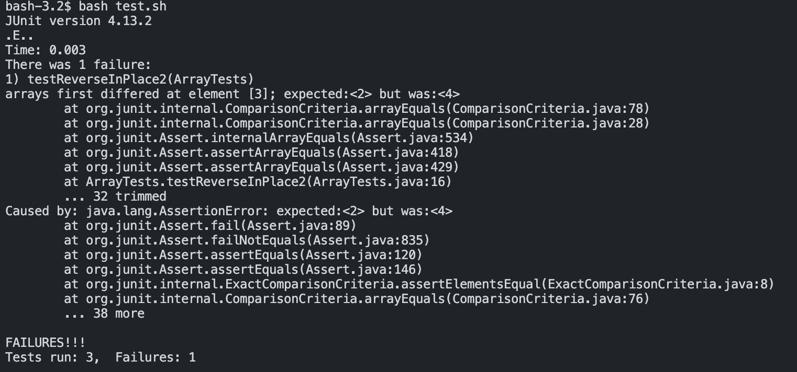
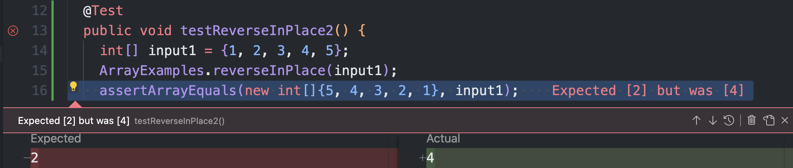
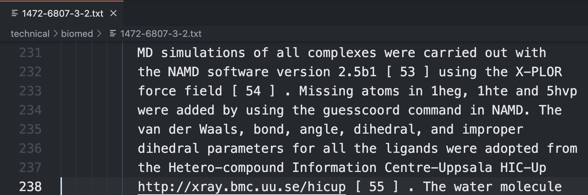
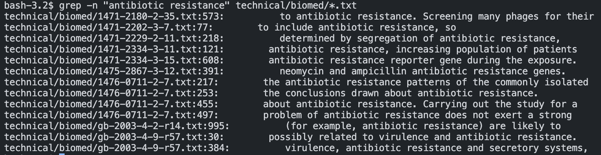
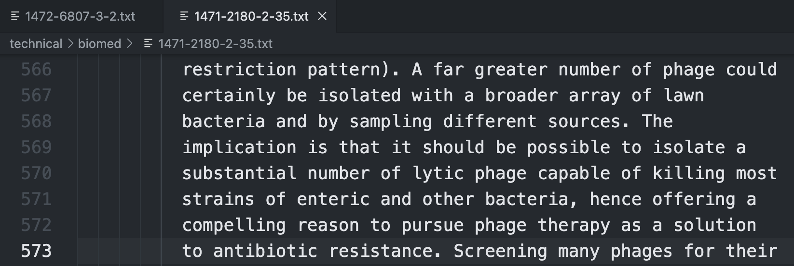
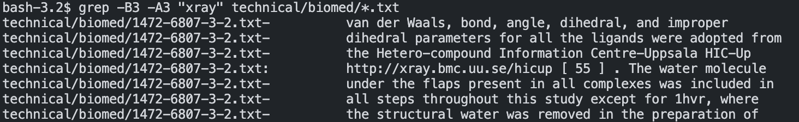
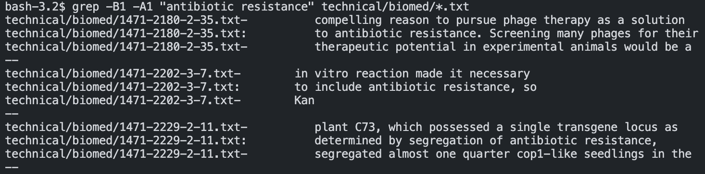
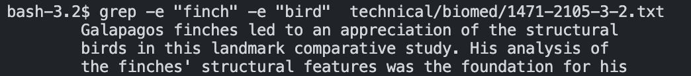
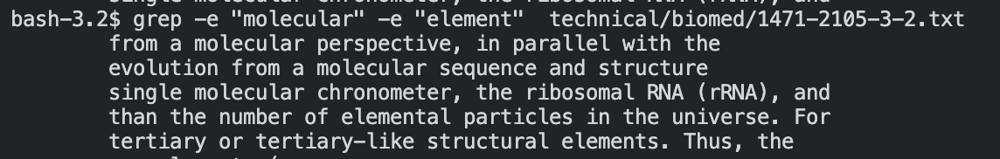

# Evan Wu - Lab 2 Report
---
## Part 1 - Bugs
---
For this part, I've chosen to look at the `reverseInPlace()` command in `ArrayExamples.java` and `ArrayTests.java`.

1. My failure inducing input was my custom test for `reverseInPlace()`:
```
@Test
public void testReverseInPlace2() {
    int[] input1 = {1, 2, 3, 4, 5};
    ArrayExamples.reverseInPlace(input1);
    assertArrayEquals(new int[]{5, 4, 3, 2, 1}, input1);
}
```
2. Non-failure inducing input that was provided for us for `reverseInPlace()`:
```
@Test 
public void testReverseInPlace() {
    int[] input1 = { 3 };
    ArrayExamples.reverseInPlace(input1);
    assertArrayEquals(new int[]{ 3 }, input1);
}
```
3. Symptom:



4. Bug fix:


Before:
```
// Changes the input array to be in reversed order
  static void reverseInPlace(int[] arr) {
      for(int i = 0; i < arr.length; i += 1) {
          arr[i] = arr[arr.length - i - 1];
      }
  }
```
After:
```
// Changes the input array to be in reversed order
  static void reverseInPlace(int[] arr) {
      for (int i = 0; i < arr.length/2; i++) {
          int temp = arr[i];
          arr[i] = arr[arr.length - i - 1];
          arr[arr.length - i - 1] = temp;
      }
  }
```
Explanation:
Running the old `reverseInPlace()` on array [1, 2, 3, 4, 5] results in the array [5, 4, 3, 4, 5]. What old `reverseInPlace()` does is make the change the first array element to the last array element's value, change the second array element to the second to last array element's value, and so on throughout the entire array. This process works until the halfway point of the array is crossed, where the next element to replace must rely on an element that has already been replaced. When we reach index 3 in the method, current element 4 should be replaced with a 2, but we find that the old 2 has already been replaced with 4. The same occurs for index 4, which should have been replaced with a 1. 

My solution to this problem uses a similar, but slightly different approach. I iterate through the first half of the array, swapping the value of an element in the first half with the value of its corresponding element in the second half. Swapping variables in this manner requires the use of a temp variable to 'hold' a value as we perform the swaps. The method and tests now work as intended.

## Part 2 - Researching Commands
---
1. `-n` flag (from ChatGPT prompt)


The `-n` flag for `grep` shows the line number of our matches. This is particularly useful if after using the `grep` command, we'd like to open up the particular text file and find the line itself. In my examples, I searched for certain strings and used the Command-click feature in VSCode to bring me to the line number.






2. `-B#` and `-A#` flags (from ChatGPT prompt)


These two flags, each followed with a number, make grep show the corresponding number of lines before and after each match. This is useful if we'd like more context into our match so we might not have to open up the file itself to get the information we need. In my first example, I show 3 lines before and after each match. In my second example, I show 1 line before and after each match.




3. `-o` flag combined with pipe (from ChatGPT prompt)


The `-o` flag only shows the matched string and nothing else. If we're only interested in seeing how many times a string appears in our files, we can use the `grep -o` command piped with `wc -l` to show the number of times the target string appears in our files.


4. `-e` flag (from https://www.linuxbuzz.com/grep-command-examples-linux/#17_Grep_with_Multiple_Pattern)


The `-e` flag allows us to use multiple find patterns within a single `grep` command. If we were interested in finding all instances of the string "dog" and "cat" for example, we now could find their occurrences with a single command rather than two.



   
## Acknowledgements - ChatGPT
--- 
For part 2 of this assignment, I used ChatGPT for inspiration. It gave me examples of interesting uses of the grep command, which I experimented with myself to determine its validity. Here are the prompts and responses that ChatGPT gave me.

Me: for a school assignment, i need to find 4 interesting ways to use the grep command. please give me 4 examples

ChatGPT: Sure, the `grep` command is incredibly versatile and can be used in a variety of interesting and powerful ways. Here are four examples that showcase different capabilities of `grep`:

1. **Recursively Search for a Pattern in Files with Specific Extensions**
   Search for the word "function" in all JavaScript files within a project directory and its subdirectories, including line numbers where the pattern is found:

   ```sh
   grep -rn --include='*.js' 'function' .
   ```

   - `-r` tells `grep` to search recursively through directories.
   - `-n` includes the line number in the output.
   - `--include` filters the search to only `.js` files.
   - `'function'` is the pattern to search for.
   - `.` specifies the current directory as the starting point for the search.

2. **Display Lines Before and After the Match**
   Find a pattern and display 3 lines before and 2 lines after the matched line for context:

   ```sh
   grep -B3 -A2 'error' log.txt
   ```

   - `-B3` displays 3 lines before each match.
   - `-A2` displays 2 lines after each match.
   - `'error'` is the search pattern.
   - `log.txt` is the file to search within.

3. **Count the Number of Matches**
   Count how many times the word "todo" appears in all `.py` (Python) files, case-insensitively:

   ```sh
   grep -Roi --include='*.py' 'todo' . | wc -l
   ```

   - `-R` or `-r` searches directories recursively.
   - `-o` shows only the matched part of the line, which, when piped to `wc -l`, will count each match rather than each line.
   - `-i` makes the search case-insensitive.
   - `--include='*.py'` restricts the search to files with the `.py` extension.
   - `wc -l` counts the number of lines, giving you the total number of matches.

4. **Invert the Match**
   Show all lines from a configuration file that are not comments or empty lines:

   ```sh
   grep -vE '^\s*(#|$)' settings.conf
   ```

   - `-v` inverts the match, showing only lines that do not match the pattern.
   - `-E` allows the use of extended regular expressions.
   - `'^\s*(#|$)'` is the pattern that matches lines that are empty or start with `#` (after optional whitespace), which are typical representations of comments or empty lines in many configuration files.
   - `settings.conf` is the file to search within.

These examples should help demonstrate the flexibility of `grep` in searching and processing text in files. Each example serves a specific and common use case that can be found in everyday tasks such as software development, system administration, and data analysis.
