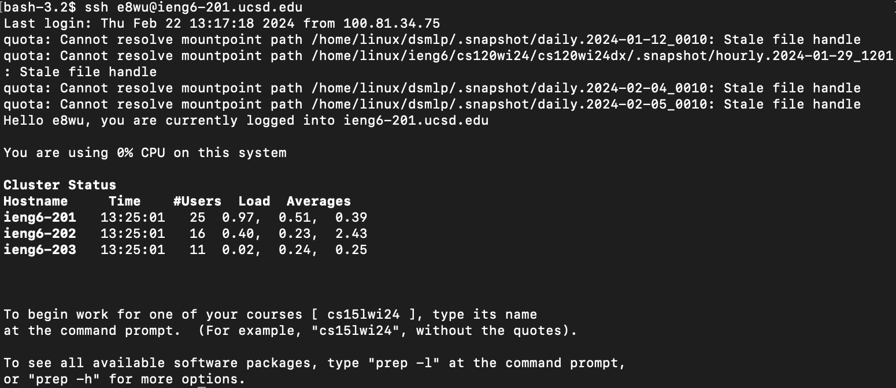
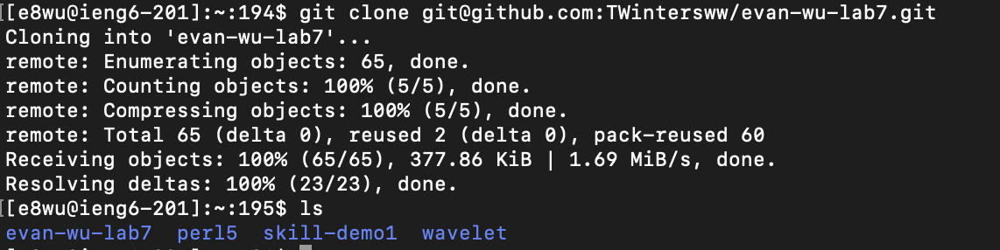
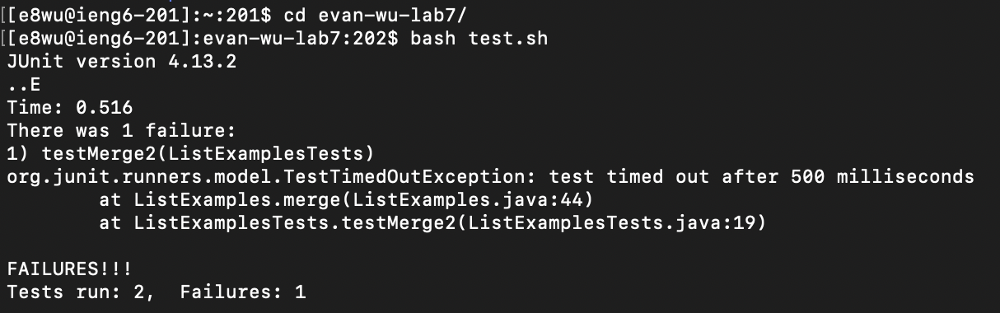
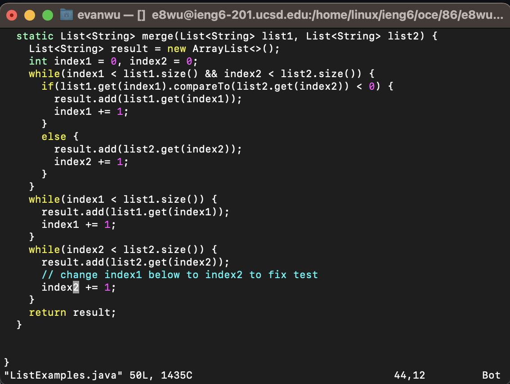
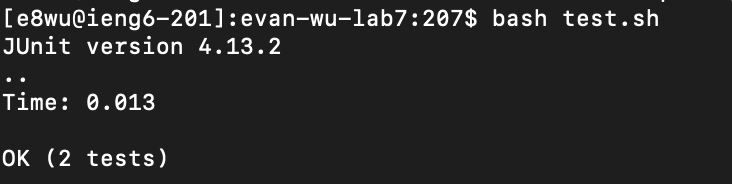
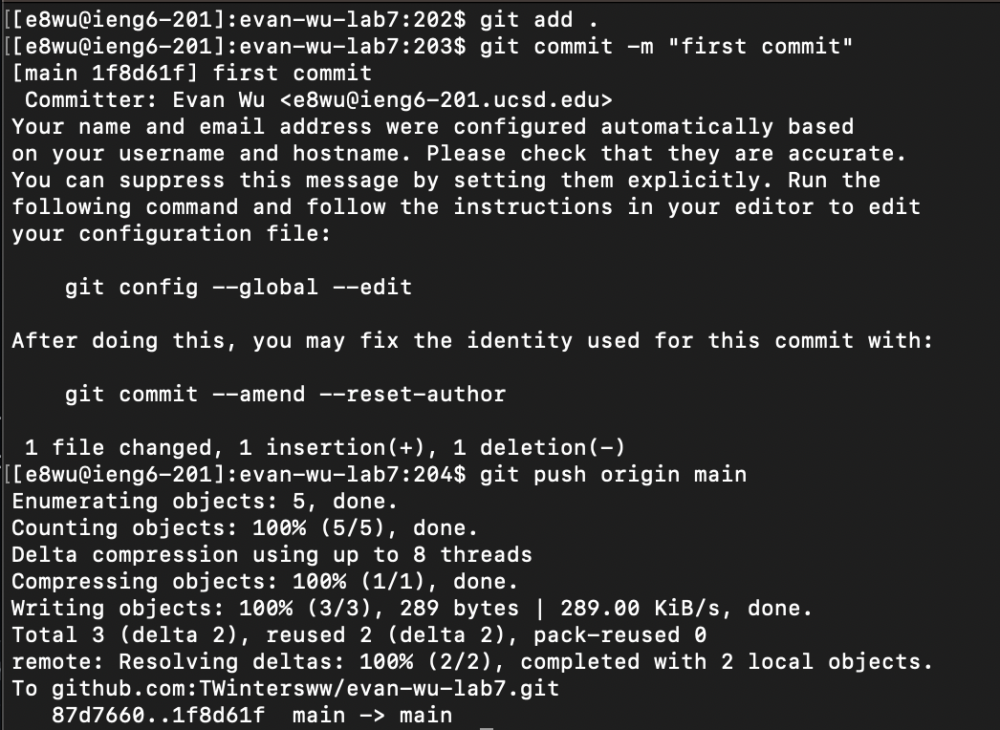
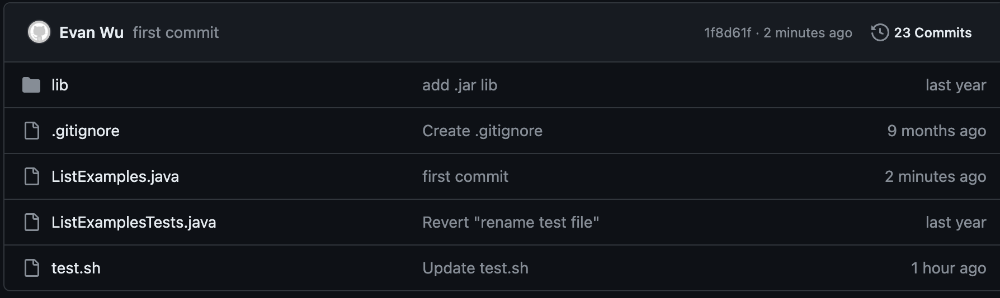

# Evan Wu - Lab 4 Report
---
## Step 4
---

Run command `$ ssh e8wu@ieng6-201.ucsd.edu` to log in to the ieng6 machine.

Keys pressed:
- `$ ssh e8wu@ieng6-201.ucsd.edu`

---
## Step 5
---

Fork the repository and run the command `$ git clone <sshurl>`. You can run `$ ls` in the current directory to confirm that the clone was successful

Keys pressed:
- `$ git clone <sshurl>`
- `$ ls`

---
## Step 6
---

Run `$ cd <cloned-repository-name>` to change into your cloned directory. Next, run `$ bash test.sh` to run the bash script that compiles and runs all our java files.
You should get an error message saying that the test timed out.

Keys pressed:
- `$ cd <cloned-repository-name>`
- `$ bash test.sh`

---
## Step 7
---

Run `$ vim ListExamples.java` to open the java file in the vim editor. Press these keys in the following order: <Shift-g> <6k> <e> <r2> <:wq!>. Capital g moves us to the last line of the file. 6k moves us up by 6 lines. e moves us to the end of the first word. r2 replaces the current letter(1) with the new letter(2). :wq! enters command line mode, executes write to save our changes, quit to exit vim with the ! meaning to force our changes. Now we are out of vim and back to our command line.

Keys pressed:
- `$ vim ListExamples.java`
- Shift-g (aka capital G)
- 6k
- e
- r2
- :wq!

---
## Step 8
---

Press the <up> arrow key twice to go through our command history so that the `$ bash test.sh` command that we previously ran pops up again. Run this command and you should see that both test cases should pass.

Keys pressed:
- < up >
- < up >
- `$ bash test.sh`

---
## Step 9
---

Now, the tests pass and everything is working. We want to commit and push our changes to github. We do this by first running `$ git add .` to stage all our files to the staging area. Even though we only changed 1 file in the repository, it's usually a good idea to use the . to stage everything (unless you specifically don't want to commit certain changes). Next, run `$ git commit -m "<commit message>"` to commit your changes locally. To push the changes to github's remote server, run `$ git push origin main` to specify that the branch we want to commit to is main. Now when you log on to github, you should be able to see your changed files and a new addition to your commit history. 

Keys pressed:
- `$ git add .`
- `$ git commit -m "<commit message>"`
- `$ git push origin main`

