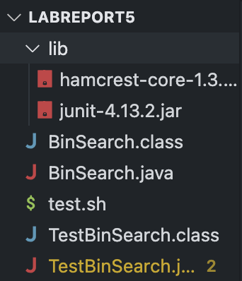
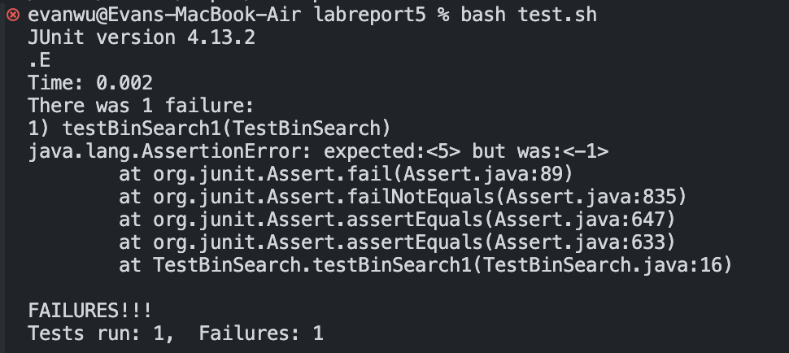
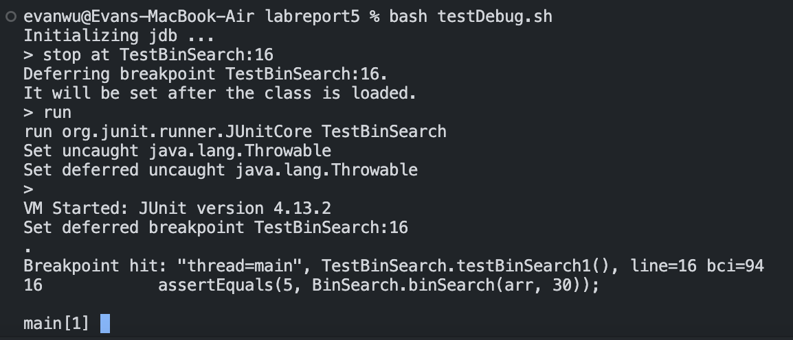
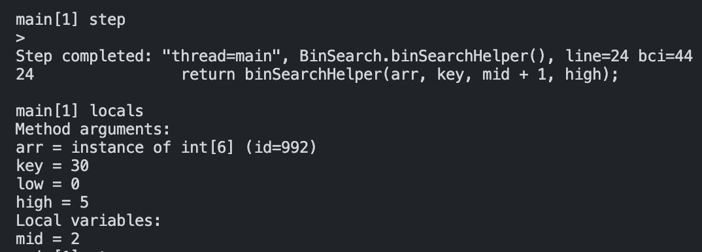
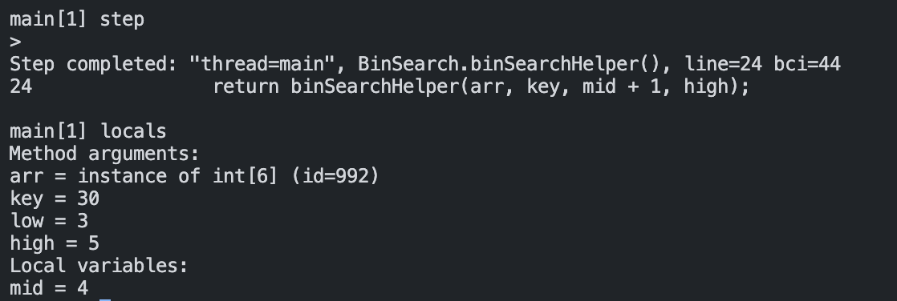
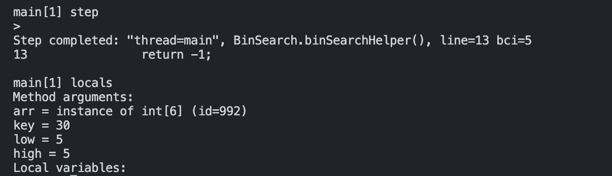
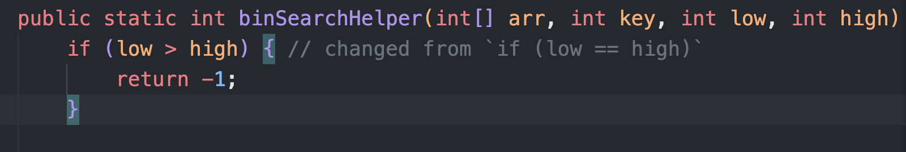
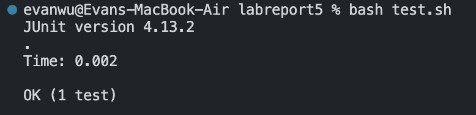

# Evan Wu - Lab 5 Report
---
## Original post from student
---

Hi there! I am writing an implementation of binary search using recursion. I also created a JUnit tester file to test the validity of my implementation. 
My working directory is /Users/evanwu/repos/labreport5. And within this directory, my file structure can be seen in the screenshot below. I have a /lib folder with my 2 JUnit files, 
a BinSearch.java file with my implementation of binary search, a TestBinSearch.java file that contains my JUnit tests, the compiled .class files of those 2 java files, and a test.sh bash script
that compiles and runs both java files in the current directory.




This is the content of my 2 java files and bash script file:

- BinSearch.java
```
public class BinSearch {

    //main method that performs a binary search
    //on an int array
    public static int binSearch(int[] arr, int key) {
        return binSearchHelper(arr, key, 0, arr.length - 1);
    }
    
    //helper method that also takes low and high index parameters
    //returns -1 if key not found
    public static int binSearchHelper(int[] arr, int key, int low, int high) {
        if (low == high) {
            return -1;
        }

        int mid = low + ((high - low) / 2);
        if (arr[mid] == key) {
            return mid;
        }
        else if (arr[mid] > key) {
            return binSearchHelper(arr, key, low, mid);
        }
        else {
            return binSearchHelper(arr, key, mid + 1, high);
        }
    }
}
```

- TestBinSearch.java
```
import org.junit.Before;
import org.junit.Test;
import static org.junit.Assert.*;
import java.beans.Transient;

public class TestBinSearch {

    @Test
    public void testBinSearch1() {
        int[] arr = new int[] {5, 10, 15, 20, 25, 30};
        assertEquals(0, BinSearch.binSearch(arr, 5));
        assertEquals(1, BinSearch.binSearch(arr, 10));
        assertEquals(2, BinSearch.binSearch(arr, 15));
        assertEquals(3, BinSearch.binSearch(arr, 20));
        assertEquals(4, BinSearch.binSearch(arr, 25));
        assertEquals(5, BinSearch.binSearch(arr, 30));
    }
}
```

- test.sh
```
set -e

javac -cp ./lib/junit-4.13.2.jar:./lib/hamcrest-core-1.3.jar:. *.java
java -cp ./lib/junit-4.13.2.jar:./lib/hamcrest-core-1.3.jar:. org.junit.runner.JUnitCore TestBinSearch
```

When I run the bash script in my terminal with the command `bash test.sh`, the JUnit output says only 4 out of my 5 test cases passed. 
Reading the JUnit output, the last test case `assertEquals(5, BinSearch.binSearch(arr, 30));` at line 16 of TestBinSearch.java does not pass for some reason. 
The test expected 5, as we can confirm that key 30 is indeed at index 5 of the int[] arr. However, the call to method BinSearch.binSearch() returns -1, meaning that the method thinks
the key 30 isn't in the int[] arr for some reason. I suspect there is something with the termination condition of the recursive method, and that the code terminates early and returns -1 
instead of being able to find key 30. 




---
## Response from TA
---

Thanks for being specific about your description of the bug and for supplying the accompanying source code. The code seems to be compiling and running find, so I agree with your diagnosis 
that there is probably something wrong with the internal logic of the code. Have you tried using the java debugger we learned about in class?


You could try running these commands, then using jdb's tools to iterate through the failing test case to inspect what's happening under the hood. 

```
javac -g -cp ./lib/junit-4.13.2.jar:./lib/hamcrest-core-1.3.jar:. *.java
jdb -classpath ./lib/junit-4.13.2.jar:./lib/hamcrest-core-1.3.jar:. org.junit.runner.JUnitCore TestBinSearch
```

Recall that the -g flag in the first line is responsible for generating extra debugging information that goes into our .class file during compile time that makes using jdb possible.
Also, pay attention to the minor change from `-cp` to `-classpath` in the second line. 

Good luck!

---
## What the student tries + what the bug is
---

I first created another bash file named `testDebug.sh` which contains the TA's commands for using the java debugger. Code listed below

- testDebug.sh
```
set -e

javac -g -cp ./lib/junit-4.13.2.jar:./lib/hamcrest-core-1.3.jar:. *.java
jdb -classpath ./lib/junit-4.13.2.jar:./lib/hamcrest-core-1.3.jar:. org.junit.runner.JUnitCore TestBinSearch
```

Then, I ran the java debugger with the bash script and instructed it to stop at line 16 of TestBinSearch.java, just before we run the final test. This allows me to later user other jdb
commands to slowly step through the code to see what's went wrong.




After using a combination of step and local commands to step through code and see all local variables, respectively, 
I ended up at the end of the first iteration of the BinSearch.binSearchHelper() method call. The contents of step and local commands are shown in the screenshot below. 
low is 0, high is 5, and mid is 2 as expected.




After the second iteration, low is 3, high is 5, and mid is 4 as expected.




At the third iteration, something weird happens. As we step through the code a few more times, the line `return -1;` executes for some reason when 
low is 5 and high is 5. What should be happening is that we should check if the value at index 5 of arr is equal to the key. Instead, we short circuit to the termination condition 
and end the method call early. 




We've now found our bug. The base case shouldn't occur when low and high are equal to each other. Rather, it should occur when low is greater than high to really make sure that we've 
checked all possible indices in our binary search.

We fix our code, changing the termination condition in BinSearch.java `if (low == high)` to `if (low > high)`. Running the JUnit tests again with `bash test.sh` shows that all test cases pass.
Our code is now fixed.






Final directory structure
```
+-- labreport5
|    +-- lib
|        +-- junit-4.13.2.jar
|        +-- hamcrest-core-1.3.jar
|    +-- BinSearch.java
|    +-- TestBinSearch.java
|    +-- test.sh
|    +-- testDebug.sh
```

---
## Reflection
---

The most interesting and most useful thing I learned in second quarter was using the java debugger. In CSE12, when I debugged failed JUnit tests, it was either by paper-and-pencil iterating through code or by using print statements. Learning about jdb added yet another tool to my toolkit that I could use in my ide to step through code, line by line or method by method call at a time and easily dump the contents of all stack-held variables for me to see. Vim was also quite interesting. I'm still quite bad at using it, but I can definitely see how it could improve efficiency. Vim is to coders as Microsoft word is to writers, it's simply a better fit for what we do.
